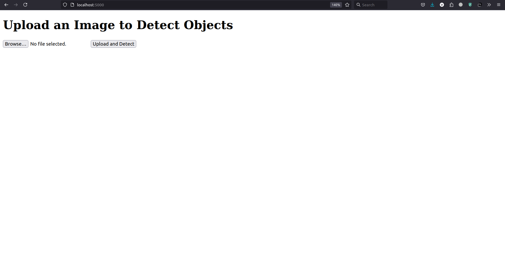
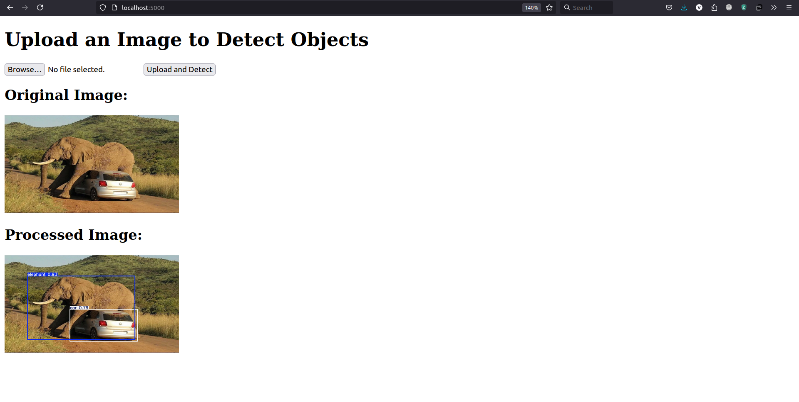
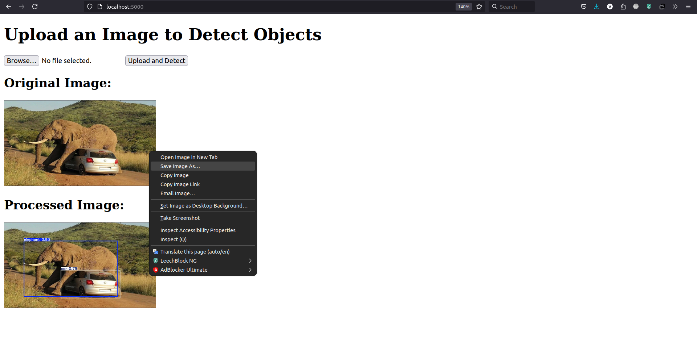

## How run project
```bash
docker compose up --build
```

You need to open the link in the browser [link]("http://localhost:5000"). You will see the next page:



Then you have to browse image. After that, you have to push down button "Upload and Convert". Then you will see the processed image.



To download the processed image you have to click right button mouse and click "Save Image As..."

